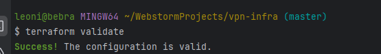
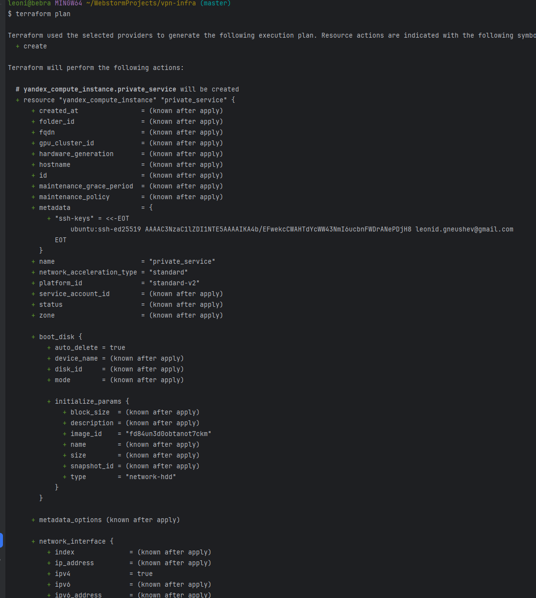
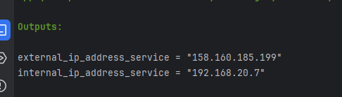
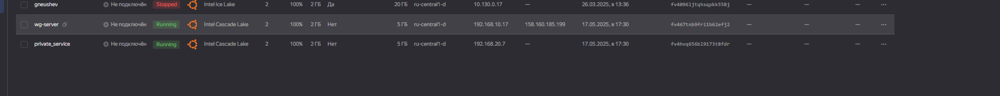
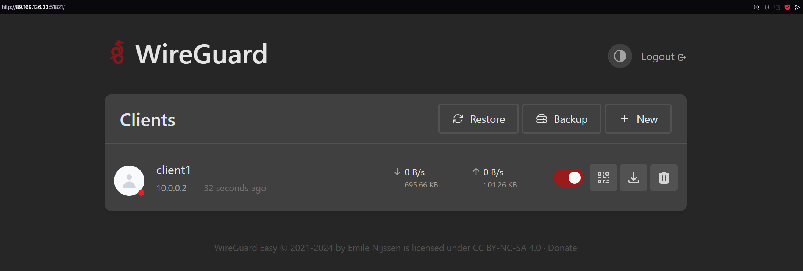
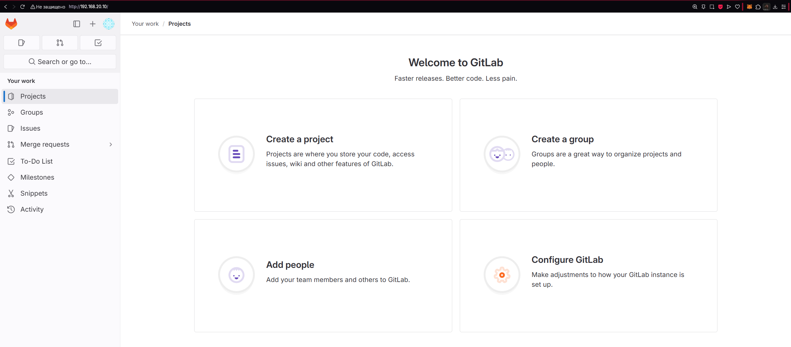

# Ход работы 

Вообще говоря, работа на этом этапе описана в документации в полной мере, конкретно файлы конфигов можно посмотреть в репозитории, инструкции по запуску и их описание ниже

Запуск инфрастуктуры, сначала применим 
`terraform validate`
для валидации спецификаций 



далее `terraform plan`, чтобы посмотреть на планируемые ресурсы 



В нем мы уже можем видеть примененные переменные 

и, наконец, `terraform apply`, чтобы развернуть инфрастуктуру 

В качестве примера, были развернуты образы ubuntu 22.04 для сервиса, и образ OpenVPN access server без настроек как впн сервер





В результате получим ip серверов, локальный для сервиса и публичный для хоста, можем посмотреть в облаке




# Запуск

Список того, что нужно для запуска инфраструктуры в Яндекс Облаке:
- Установить CLI яндекс облака
- Инициализировать CLI яндекс облака
- Узнать FOLDER_ID, CLOUD_ID, OAuth токен
- Установить и запустить terraform

## CLI инициализация
Гайд по установке- https://yandex.cloud/ru/docs/cli/operations/install-cli

Далее нужно создать профиль и аутентифицироваться посредством токена, запоминаем его

```bash
yc init
```
```bash
Welcome! This command will take you through the configuration process.
Pick desired action:
[1] Re-initialize this profile 'supacad2' with new settings
[2] Create a new profile
[3] Switch to and re-initialize existing profile: 'default'
[4] Switch to and re-initialize existing profile: 'supacad'
Enter profile name. Names start with a lower case letter and contain only lower case letters a-z, digits 0-9, and hyphens '-': ovpn-test
Please go to <Ваша ссылка> in order to obtain OAuth token.
 Please enter OAuth token: <Ваш токен>
```

## Запуск тераформа


Гайд от яндекса по установке- https://yandex.cloud/ru/docs/tutorials/infrastructure-management/terraform-quickstart


### **Важно!!**

---
### _При использовании terraform init лучше включить VPN_ 

---

В спецификации для создания ресурсов нужно присвоить переменным терраформа значения, есть 2 способа это сделать
1. В Интерактивном режиме, при запуске terraform ввести значения переменным(это неудобно)
2. Через файл terraform.tfvars.example(удобней, если нужно запускать терраформ больше 1 раза)
    
    Нужно изменить название файла `terraform.tfvars.example` -> `terraform.tfvars`

    После, необходимо вписать нужные значения для переменных
```shell
token=""
cloud_id=""
folder_id=""
private_service_image=""
public_ip_address_id=""
```

## Структура 

`main.tf` - Точка входа, указываем провайдер яндекс клауда

`service.tf` - Спецификация для создания ВМ с вашим приватным сервисом

`vpn-server.tf` - Спецификация для создания ВМ с впном, через которую будет предоставляться доступ к приватному сервису 

`net.tf` - Общая сеть для машин

`variables.tf` - Файл с переменными 

`terraform.tfvars.example` - Файл для хранения значений переменных, нужен для удобного использования спецификации


### `main.tf`

Общие настройки провайдера
```terraform
terraform {
    required_providers {
    yandex = {
        source = "yandex-cloud/yandex"
        version = ">= 0.80"
        }
    }
}

provider "yandex" {
    token  =  var.token
    cloud_id  = var.cloud_id
    folder_id = var.folder_id
    zone      = "ru-central1-d"
}
```
### `service.tf`

Создаем виртуальную машину, на которой будет запущен сервис, к которому мы будем получать доступ с помощью VPN.

Также создаем сеть, сама вм будет без публичного адреса

В метаданные записываем ssh ключ 

```terraform
resource "yandex_vpc_route_table" "wg_host_rt" {
  name       = "wg-host-rt"
  network_id = yandex_vpc_network.virtual_private_network.id

  static_route {
    destination_prefix = "0.0.0.0/0"
    next_hop_address   = "192.168.10.10"
  }
}

resource "yandex_vpc_subnet" "private_subnet" {
  name           = "private-subnet"
  network_id     = yandex_vpc_network.virtual_private_network.id
  v4_cidr_blocks = ["192.168.20.0/24"]
  route_table_id = yandex_vpc_route_table.wg_host_rt.id
  zone           = "ru-central1-b"
}

resource "yandex_compute_instance" "private_service" {
  name        = "private-service"
  platform_id = "standard-v2"
  zone        = "ru-central1-b"

  resources {
    cores  = 4
    memory = 8
  }

  boot_disk {
    initialize_params {
      image_id = var.private_service_image
      size     = 100
    }
  }

  network_interface {
    subnet_id  = yandex_vpc_subnet.private_subnet.id
    ip_address = "192.168.20.10"
  }

  metadata = {
    user-data = <<-EOF
#cloud-config
users:
  - name: user
    groups: sudo
    shell: /bin/bash
    sudo: 'ALL=(ALL) NOPASSWD:ALL'
    ssh_authorized_keys:
      - ${file("~/.ssh/id_ed25519.pub")}
EOF
  }
}
```

### `vpn-server.tf`

Это сервер VPN, его было решено развернуть с помощью опции Container Solution, предоставляемой Yandex Cloud.

```terraform
data "yandex_compute_image" "container-optimized-image" {
  family = "container-optimized-image"
}

data "yandex_vpc_address" "static_addr" {
  address_id = var.public_ip_address_id
}

resource "yandex_vpc_subnet" "server_subnet" {
  name           = "server-subnet"
  network_id     = yandex_vpc_network.virtual_private_network.id
  v4_cidr_blocks = ["192.168.10.0/24"]
  zone           = "ru-central1-a"
}

resource "yandex_compute_instance" "wg-server" {
  name        = "wg-server"
  platform_id = "standard-v2"
  zone        = "ru-central1-a"

  resources {
    cores  = 2
    memory = 2
  }

  boot_disk {
    initialize_params {
      image_id = data.yandex_compute_image.container-optimized-image.id
    }
  }

  network_interface {
    subnet_id      = yandex_vpc_subnet.server_subnet.id
    ip_address     = "192.168.10.10"
    nat_ip_address = data.yandex_vpc_address.static_addr.external_ipv4_address[0].address
    nat            = true
  }

  metadata = {
    docker-compose = file("${path.module}/vpn-server-docker-compose.yml")
    ssh-keys       = "user:${file("~/.ssh/id_ed25519.pub")}"
  }
}
```

Файл docker-compose, описывающий сервис VPN, использующийся в vpn-server.tf

```dockerfile
volumes:
  etc_wireguard:

services:
  wg-easy:
    environment:
      # Change Language:
      # (Supports: en, ua, ru, tr, no, pl, fr, de, ca, es, ko, vi, nl, is, pt, chs, cht, it, th, hi)
      - LANG=en
      # ⚠️ Required:
      # Change this to your host's public address
      - WG_HOST=89.169.136.33

      # Optional:
      - PASSWORD_HASH=$$2a$$12$$80EVRBQr.A.YZFDdaTMdwueWGqDDiQEGOu4e.j8UV..SBAmd80NVe
      # - PORT=51821
      # - WG_PORT=51820
      # - WG_CONFIG_PORT=92820
      - WG_DEFAULT_ADDRESS=10.0.0.x
      # - WG_DEFAULT_DNS=1.1.1.1
      - WG_MTU=1500
      - WG_ALLOWED_IPS=10.0.0.1/32,192.168.20.0/24
      - WG_PERSISTENT_KEEPALIVE=25
      # - WG_PRE_UP=echo "Pre Up" > /etc/wireguard/pre-up.txt
      # - WG_POST_UP=echo "Post Up" > /etc/wireguard/post-up.txt
      # - WG_PRE_DOWN=echo "Pre Down" > /etc/wireguard/pre-down.txt
      # - WG_POST_DOWN=echo "Post Down" > /etc/wireguard/post-down.txt
      # - UI_TRAFFIC_STATS=true
      # - UI_CHART_TYPE=0 # (0 Charts disabled, 1 # Line chart, 2 # Area chart, 3 # Bar chart)

    image: ghcr.io/wg-easy/wg-easy:latest
    container_name: wg-easy
    volumes:
      - etc_wireguard:/etc/wireguard
    ports:
      - "51820:51820/udp"
      - "51821:51821/tcp"
    restart: unless-stopped
    cap_add:
      - NET_ADMIN
      - SYS_MODULE
      # - NET_RAW # ⚠️ Uncomment if using Podman
    sysctls:
      - net.ipv4.ip_forward=1
      - net.ipv4.conf.all.src_valid_mark=1
```

### `net.tf`

Конфигурация сети, в которой будет располагаться инфра

```terraform
resource "yandex_vpc_network" "virtual_private_network" {
  name = "virtual-private-network"
}
```

### `variables.tf`

В принципе по описанию понятно, за что отвечает каждая переменная
```terraform
variable "token" {
  description = "OAuth токен вашего аккаунта"
  type        = string
}
variable "cloud_id" {
  description = "Айди облака, в котором будут создаваться ресурсы"
  type        = string
}
variable "folder_id" {
  description = "Айди папки, в которой будут создаваться ресурсы"
  type        = string
}

variable "private_service_image" {
  description = "Айди образа для ВМ с вашим сервисом"
  type        = string
}

variable "public_ip_address_id" {
  description = "Айди статического ip-адреса для сервера vpn"
  type        = string
}
```

## Обзор функциональности

После создания инфраструктуры в облаке с помощью terraform apply, можно полноценно пользоваться развёрнутыми сервисами. В нашем случае, это:
1. Сервер WireGuard VPN с Web GUI, позволяющим легко добавлять клентов и получать их файлы конфигурации, необходимые для подключения (доступен по адресу, указанному в качестве публичного для севрера VPN и порту 51821)

2. Приватный сервер с GitLab, доступный по локальному адресу 192.168.20.10 после подключения к VPN

