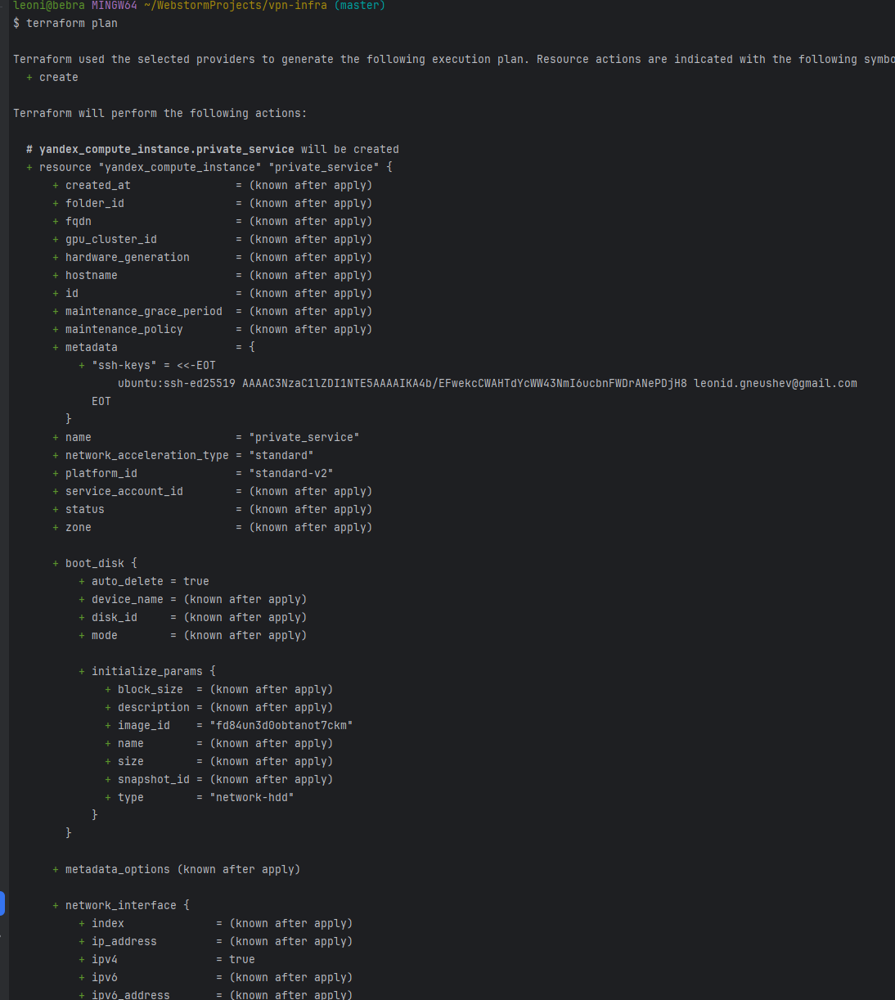
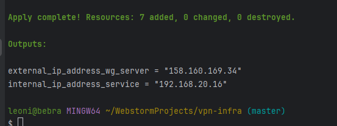
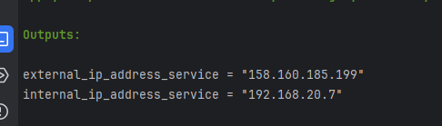
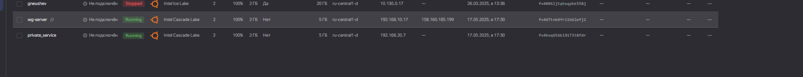

# Ход работы 

Вообще говоря, работа на этом этапе описана в документации в полной мере, конкретно файлы конфигов можно посмотреть в репозитории, инструкции по запуску и их описание ниже

Запуск инфрастуктуры, сначала применим 
`terraform validate`
для валидации спецификаций 


далее `terraform plan`, чтобы посмотреть на планируемые ресурсы 



В нем мы уже можем видеть примененные переменные 

и, наконец, `terraform apply`, чтобы развернуть инфрастуктуру 

В качестве примера, были развернуты образы ubuntu 22.04 для сервиса, и образ OpenVPN access server без настроек как впн сервер



В результате получим ip серверов, локальный для сервиса и публичный для хоста, можем посмотреть в облаке




# @todo Тагир чекнет что нет так с ключами и cloud init 


# Запуск

Список того, что нужно для запуска инфраструктуры в Яндекс Облаке:
- Установить CLI яндекс облака
- Инициализировать CLI яндекс облака
- Узнать FOLDER_ID, CLOUD_ID, OAuth токен
- Установить и запустить terraform

## CLI инициализация
Гайд по установке- https://yandex.cloud/ru/docs/cli/operations/install-cli

Далее нужно создать профиль и аутентифицироваться посредством токена, запоминаем его

```bash
yc init
```
```bash
Welcome! This command will take you through the configuration process.
Pick desired action:
[1] Re-initialize this profile 'supacad2' with new settings
[2] Create a new profile
[3] Switch to and re-initialize existing profile: 'default'
[4] Switch to and re-initialize existing profile: 'supacad'
Enter profile name. Names start with a lower case letter and contain only lower case letters a-z, digits 0-9, and hyphens '-': ovpn-test
Please go to <Ваша ссылка> in order to obtain OAuth token.
 Please enter OAuth token: <Ваш токен>
```

## Запуск тераформа


Гайд от яндекса по установке- https://yandex.cloud/ru/docs/tutorials/infrastructure-management/terraform-quickstart


### **Важно!!**

---
### _При использовании terraform init лучше включить VPN_ 

---

В спецификации для создания ресурсов нужно присвоить переменным терраформа значения, есть 2 способа это сделать
 1. В Интерактивном режиме, при запуске terraform ввести значения переменным(это неудобно)
```shell
terraform plan
var.cloud_id
  Айди облака, в котором будут создаваться ресурсы

  Enter a value: b1g***********

var.folder_id
  Айди папки, в котором будут создаваться ресурсы

  Enter a value: b1gmq4m*********** 

var.gitlab_image_id
  Айди образа для ВМ с впном

  Enter a value: fd88o3huv4mm2jndnrl1 // ПРИМЕР ubuntu 22.04

var.token
  IAM токен вашего сервисного аккаунта

  Enter a value: y0__xCpn4N*********** 

var.wg_image_id
  Айди образа для ВМ с впном
 
  Enter a value: fd88o3huv4mm2jndnrl1 // ПРИМЕР ubuntu 22.04


Terraform used the selected providers to generate the following execution plan. Resource actions are indicated with the following symbols:
  + create

Terraform will perform the following actions:

  # yandex_compute_instance.wg-server will be created

```
2.  Через файл terraform.tfvars.example(удобней, если нужно запускать терраформ больше 1 раза)
    
    Нужно изменить название файла `terraform.tfvars.example` -> `terraform.tfvars`

    После, необходимо вписать нужные значения для переменных 


## Структура 

`main.tf` - Точка входа, указываем провайдер яндекс клауда

`service.tf` - Спецификация для создания ВМ с вашим приватным сервисом

`vpn-server.tf` - Спецификация для создания ВМ с впном, через которую будет предоставляться доступ к приватному сервису 

`net.tf` - Общая сеть для машин

`variables.tf` - Файл с переменными 

`terraform.tfvars.example` - Файл для хранения значений переменных, нужен для удобного использования спецификации


### `main.tf`

Общие настройки провайдера
```terraform
terraform {
    required_providers {
    yandex = {
        source = "yandex-cloud/yandex"
        version = ">= 0.80"
        }
    }
}

provider "yandex" {
    token  =  var.token
    cloud_id  = var.cloud_id
    folder_id = var.folder_id
    zone      = "ru-central1-d"
}
```
### `service.tf`

Создаем виртуальную машину с минимальной конфигурацией, в качестве айди образа используем значение из переменной

Также создаем сеть, сама вм будет без публичного адреса

В метаданные записываем ssh ключ 

```terraform
resource "yandex_compute_instance" "private_service" {
  name = "private_service"
  platform_id = "standard-v2"

  resources {
    cores  = 2
    memory = 2
  }

  boot_disk {
    initialize_params {
      image_id = var.private_service_image
    }
  }

  network_interface {
    subnet_id          = yandex_vpc_subnet.private_subnet.id
  }

  metadata = {
    ssh-keys = "ubuntu:${file(var.path_to_ssh_key)}"
  }
}

resource "yandex_vpc_subnet" "private_subnet" {
  name           = "private_subnet"
  network_id     = yandex_vpc_network.virtual_private_network.id
  v4_cidr_blocks = ["192.168.20.0/24"]
}

resource "yandex_vpc_route_table" "wg-host-rt" {
  network_id = yandex_vpc_network.virtual_private_network.id
  name = "wg-host-rt"

  static_route {
    gateway_id = yandex_vpc_gateway.wg_nat.id
    destination_prefix = "0.0.0.0/0"
  }
}

resource "yandex_vpc_gateway" "wg_nat" {
  name = "wg-nat"
  shared_egress_gateway {}
}

output "internal_ip_address_service" {
  value = yandex_compute_instance.private_service.network_interface.0.ip_address
}

```

`vpn-server.tf`

Это впн сервер, который должен браться из определенного образа
```terraform
resource "yandex_compute_instance" "wg-server" {
  name = "wg-server"
  platform_id = "standard-v2"

  resources {
    cores  = 2
    memory = 2
  }

  boot_disk {
    initialize_params {
      image_id = var.wg_image_id
    }
  }

  network_interface {
    subnet_id = yandex_vpc_subnet.server_subnet.id
    nat = true
  }

  metadata = {
    ssh-keys = "ubuntu:${file(var.path_to_ssh_key)}"
  }
}


resource "yandex_vpc_subnet" "server_subnet" {
  name           = "server-subnet"
  network_id     = yandex_vpc_network.virtual_private_network.id
  v4_cidr_blocks = ["192.168.10.0/24"]
}

output "external_ip_address_wg_server" {
  value = yandex_compute_instance.wg-server.network_interface.0.nat_ip_address
}

```

`net.tf`

Создает сеть, в которой будет располагаться инфра

```terraform
resource "yandex_vpc_network" "virtual_private_network" {
  name = "virtual_private_network"
}
```

`variables.tf`

В принципе по описанию понятно, за что отвечает каждая переменная
```terraform
variable "token" {
  description = "OAuth токен вашего аккаунта"
  type = string
}
variable "cloud_id" {
  description = "Айди облака, в котором будут создаваться ресурсы"
  type = string
}
variable "folder_id" {
  description = "Айди папки, в которой будут создаваться ресурсы"
  type = string
}

variable "wg_image_id" {
  description = "Айди образа для ВМ с впном"
  type = string
}

variable private_service_image {
  description = "Айди образа для ВМ с вашим сервисом"
  type = string
}

variable "path_to_ssh_key" {
  description = "Путь к ключу ssh, для доступа к серверу"
  type = string
}
```
